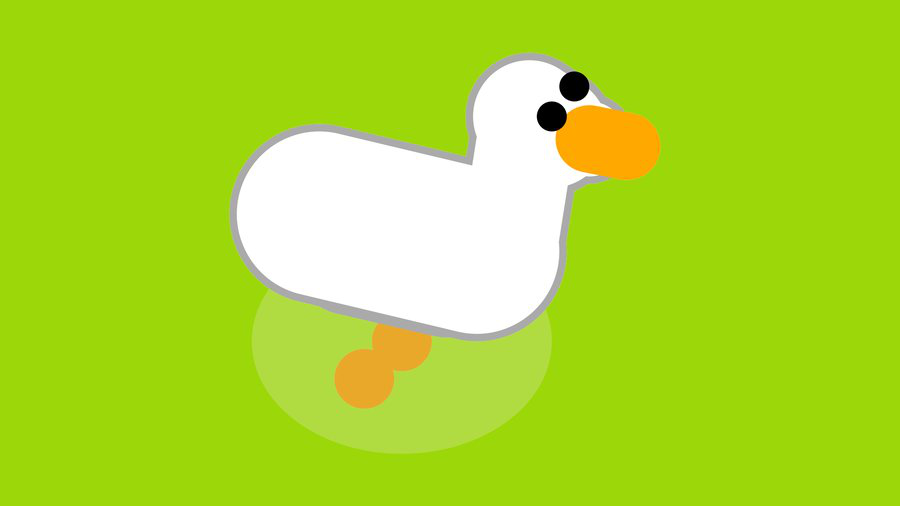

#   
___

##### I found this image on [Samperson's itch.io page](https://samperson.itch.io/).

### What Is "The Goosenator 6000"?

"The Goosenator 6000" is an application you load onto a USB drive that can configure and install Desktop Goose in many ways. It works on almost any modern Microsoft Windows operating system.

### What Is ["Desktop Goose"](https://samperson.itch.io/desktop-goose)?

["Desktop Goose"](https://samperson.itch.io/desktop-goose) is an application with the sole purpose of causing chaos. The goose will run around your screen stealing your mouse, tracking mud, writing notes, and bringing memes. He also honks, A LOT. [Simulation of "Desktop Goose" honking.](/hjonk.mp3) (Credit to [House House](https://househou.se) for this honking noise.)

### Installation Guide

First, download the source code or release of your choice. Second, extract the .zip file you just downloaded from this GitHub repository or my website then copy-paste the contents of the .zip on to a USB drive (Make sure the contents of the .zip are in the root of the USB drive and not in a folder.) if you downloaded the source code. If you downloaded the .exe file double click it and replace the directory the installer wants to install to with D:\ . NOTE: You MUST have "The Goosenator 6000" on a D: drive. It was programmed with the D: drive in mind and using any other letter mapped with your USB will require modification of the code. ALSO NOTE: "The Goosenator 6000" uses a modified version of ["Desktop Goose"](https://samperson.itch.io/desktop-goose).

### How Do I Use "The Goosenator 6000"?

You use "The Goosenator 6000" as follows: First you run the "Installer 1" file off the USB. Once this is done you have the modified ["Desktop Goose"](https://samperson.itch.io/desktop-goose) Installed on the computer. Now you have full freedom, you can turn on music, make the goose rainbow, and so much more!

Haveeee fuun wittth youur gooossse!!1! (Sorry about the typo's, it is hard to type with a goose attacking you)

### Special Thanks

All credit for ["Desktop Goose"](https://samperson.itch.io/desktop-goose) goes to [Samperson](https://samperson.itch.io/). The idea for both "Desktop Goose" and "The Goosenator 6000" came from ["Untitled Goose Game"](https://goose.game/), a video game about a goose wreaking havoc on a small town made by [House House](https://househou.se/). The rest of the project was programmed by me, [@Norok-The-Diablo](https://github.com/Norok-The-Diablo/) aka Toma Brasoveanu, a Romanian-American programmer.

#### Official trailer of ["Desktop Goose"](https://samperson.itch.io/desktop-goose) made by [Samperson](https://samperson.itch.io/):

## * DISCLAIMER * I am NOT affiliated with [Samperson](https://samperson.itch.io/) or [House House](https://househou.se). I am also NOT liable for any damage done to your computer using this application.

                               

#                                                               MAY THE GOOSE BE WITH YOU...

##### I found this image on [Samperson's itch.io page](https://samperson.itch.io/).

#### hjonk! [🦢](https://Goosenator6000.github.io/password)
